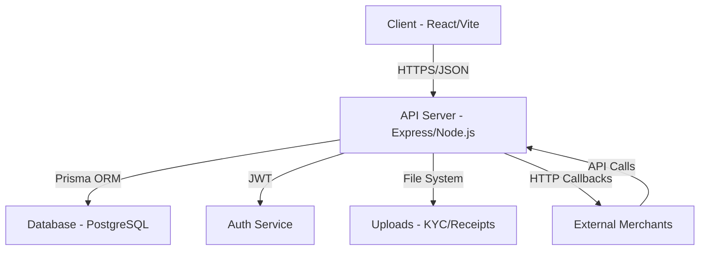

# Project Documentation: AbheePay / Leopay Platform

## 1. Executive Summary
AbheePay (also known as Leopay) is a comprehensive B2B Fintech and QR Payment Gateway designed to facilitate digital transactions between merchants, distributors, and administrative entities. The platform provides a robust infrastructure for QR code generation, wallet management, settlement processing, and comprehensive reporting.

### Key Value Propositions
- **Multi-tenant Architecture**: Support for a strict three-tier hierarchy (Admin -> Merchant -> Branch).
- **Dynamic QR Payments**: Real-time generation, tracking, and allocation of UPI-based QR codes across the hierarchy.
- **Wallet Infrastructure**: Integrated ledger system for real-time balance management and fund transfers.
- **Developer First**: Integrated API documentation and callback logging for merchant integrations.

---

## 2. Architecture Overview
The platform is built on a modern monorepo architecture, separating concerns between a high-performance backend and a responsive, feature-rich frontend.

### System Diagram

### Infrastructure Components
- **Frontend**: A Single Page Application (SPA) providing distinct dashboards for Admin and Merchant roles.
- **Backend**: A RESTful API built with Express, utilizing TypeScript for type safety and Prisma for efficient data modeling.
- **Database**: PostgreSQL handles structured data, including user profiles, transactions, and commission structures.

---

## 3. Technology Stack

### Frontend
- **React 19**: Modern UI library for building interactive interfaces.
- **Vite**: Ultra-fast build tool and development server.
- **React Router 7**: Sophisticated routing for multi-page experience.
- **Recharts**: Data visualization for dashboards and financial reports.
- **Vanilla CSS**: Custom design system focused on high performance and premium aesthetics.

### Backend
- **Node.js & Express**: Core runtime and web framework.
- **TypeScript**: Ensuring robustness and maintainability through static typing.
- **Prisma**: Type-safe ORM for PostgreSQL interactions.
- **JWT (JSON Web Tokens)**: Secure stateless authentication.
- **Multer**: Handling file uploads for KYC and payment proofs.
- **Zxing/jsQR**: QR code generation and decoding capabilities.

---

## 4. Key Modules & Features

### A. User Management & Roles
The platform implements a sophisticated role-based access control (RBAC) system with a strict hierarchy:
- **Admin**: Full system control, bulk QR acquisition, and Merchant onboarding.
- **Merchant**: Acts as an 'Admin' for their own fleet. can create branches and re-assign allocated QR codes to them.
- **Branch**: End-point sub-agents that utilize QR codes for payment collection.
- **KYC Engine**: Integrated document upload and verification workflow for onboarding merchants and branches.

### B. Payment & QR System
- **Dynamic QR Generation**: Create unique, trackable QR codes for specific merchants or transactions.
- **Instant Pay**: Fast settlement and payment routing.
- **Callback System**: Real-time POST notifications to merchant URLs upon successful payment.

### C. Wallet & Financials
- **Ledger System**: Double-entry bookkeeping for every transaction.
- **Commission Slabs**: Highly configurable commission structures based on user roles and service types.
- **Fund Requests**: Workflow for users to request wallet top-ups via bank transfer with automated approval paths.

### D. Support & Communication
- **Ticket System**: Built-in support module for resolving user queries and technical issues.
- **Notifications**: System-wide notifications for transaction alerts and account updates.

---

## 5. Data Model (Schema Highlights)

The database consists of over 20 tables managed via Prisma. Key entities include:
- **User & Profile**: Authentication and extended user metadata.
- **Wallet & WalletTransaction**: Real-time balance and ledger tracking.
- **QrCode**: Stores configuration and paths for dynamic QR codes.
- **Transaction**: Master record for all payment activities.
- **CommissionSlab**: Pricing and payout rules for the platform hierarchy.

---

## 6. Deployment & Configuration

### Environment Setup
- **Monorepo Root**: Manage both apps using `concurrently`.
- **Environment Variables**: Managed through `.env` files in both `client/` and `backend/` directories.

### Deployment Path
- **Frontend**: Optimized for high-performance static hosting (Vercel, Render, or cPanel/Apache).
- **Backend**: Requires a Node.js process manager (PM2) for production stability.
- **Database**: Connection via connection strings (supporting Neon/PostgreSQL SSL).

---

## 7. Security Best Practices
- **Password Hashing**: Bcryptjs implementation for storing sensitive credentials.
- **Role Guards**: Middleware-based route protection on both frontend and backend.
- **TPIN (Transaction PIN)**: Secondary authentication layer for financial operations.
- **Input Validation**: Strict schema verification for all API requests.

 
